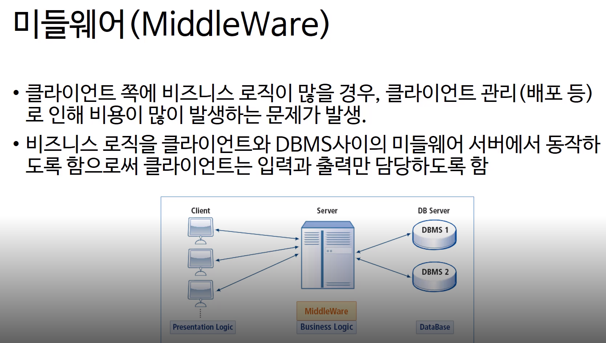
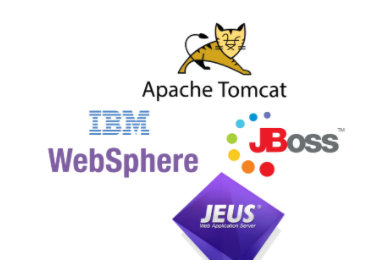

# 0818 WAS와 웹서버

## 1. Web 서버란

- 클라이언트가 서버에 페이지 요청을 하면 요청을 받아`` **정적** 컨텐츠(.html, .png, .css등)``를 제공하는 서버
- 클라이언트에서 요청이 올 때 가장 앞에서 요청에 대한 처리를 진행함
- 작동 Process
  - 1. 클라이언트 콘텐츠 요청
    2. 만약 정적 콘텐츠 요청이면, 웹서버에서 정정 콘텐츠 클라이언트에게 전달
       만약 동적 콘텐츠 요청이면, 웹서버에서 처리하기 버거움. -> WAS에게 요청
    3. 끝.
- 대표적인 웹서버: Apache, nginx

## 2. WAS란

- DB조회 혹은 로직처리가 요구되는 동적콘텐츠를 제공하기 위해 만들어진 Web Application Server이다. 
- 좀 더 구체적으로는 분산 트랜잭션, 보안, 메시징, 쓰레드 처리 등의 기능을 처리하는 분산환경에서 사용되는 미들웨어이다.
- 클라이언트에서 DB서버로 데이터를 직접 요청하는 것에 여러 문제가 있었다. 첫 번째는 보안 문제, 두 번째는 클라이언트와 DB의 갯수가 많아지면서 로직이 복잡해진다는 것이다.  따라서, 미들웨어라는 새로운 개념이 생겼는데, 클라이언트는 이 미들웨어에 자신의 요청을 모두 전송하고 이 미들웨어는 가운데에서 이를 db서버에 전달하고 response를 받아 다시 클라이언트에 전달하는 역할을 수행한다. 
- JSP, Servlet이 구동할 수 있는 환경을 제공한다.
- 컨테이너, 웹컨테이너 혹인 서블릿 컨테이너라고도 부른다.

- 동작 프로세스

  1. 웹서버로부터 요청이 오면 컨테이너가 받아서 처리

  2. 컨테이너는 web.xml을 참조하여 해당 서블릿에 대한 쓰레드 생성하고 httpServletRequest와 httpServletResponse 객체를 생성하여 전달한다.

  3. 컨테이너는 서블릿을 호출한다.

  4. 호출된 서블릿의 작업을 담당하게 된 쓰레드(2번에서 만든 쓰레드)는 doPost()또는 doGet()을 호출한다.

  5. 호출된 doPost(), doGet() 메소드는 생성된 동적 페이지를 Response객체에 담아 컨테이너에 전달한다.

  6. 컨테이너는 전달받은 Response객체를 HTTPResponse형태로 바꿔 웹서버에 전달하고 생성되었던 쓰레드를 종료하고 httpServletRequest, httpServletResponse 객체를 소멸시킨다.

     

- 대표 : Tomcat, Jeus, JBoss

## 3. 웹서버와 WAS 구조

웹서버는 다양한 구조를 가질 수 있다.

- Client -> Web Server -> DB
- Client -> WAS -> DB
- Client -> Web Server -> WAS -> DB

이 중에서 가장 마지막 구조인 `Client -> Web Server -> WAS -> DB`가 위의 도식화된 형태이고, 이렇게 가장 많이 구분되어 있는 구조가 좋다고 평가받고 있다. 그 이유는 아래 상세히 설명된다.

## 4. 웹서버와 WAS 구분 이유

- 일단 WAS는 웹서버의 역할도 맡을 수 있다.
- 이전에는 정적콘텐츠까지 WAS에서 하기에는 서버에 부하를 많이 줘 비효율적이어서 나눴었다. 하지만 최근에는 WAS의 성능이 더 올라갔기 때문에 굳이 성능상의 이유때문에 둘을 나누지는 않는다고 한다. 
- 그럼에도 불구하고 이 두 가지를 구분해서 쓰고 있는데 이유는 다음과 같다.
  - 1) 물리적 분리로 인한 보안 강화: WAS는 db서버를 호출하는 역할을 맡는데, 이 db서버에는 회원정보와 같이 가장 중요한 정보들이 들어있다. 따라서 클라이언트와 가장 가까이 있는 웹서버의 보안이 뚫려도, WAS에서 db에 접근하는 한 단계가 더 생기므로 보안에 취약하다. 반면, 웹서버와 WAS를 구분하지 않는 경우 한 번에 다 뚫리기 때문에 보안에 취약하다. 
  - 2) 여러 WAS를 연결할 수 있음: java서버, C서버, php서버 등 하나의 웹서버를 통해 여러 서비스가 가능하다.
  - 3) 특히나 서비스의 규모가 커질수록 WAS와 웹서버를 더욱 분리함. 그 목적은 장애 극복을 좀 더 용이하게 하기 위함이다.
  - *장애 극복* - 만약 WAS에 오류가 났을 경우, 웹서버에서 이를 인지하고 사용자가 오류가 난 WAS에 접근하지 못하도록 막고 WAS를 재시작한다. 이때, 이 사용자가 WAS를 호출하는 요청을 하기 전까지는 웹서버에서 정적콘텐츠(html, png) 등을 보여주고 있기 때문에 오류상황을 인지하지 못할 수 있다.
- Web Server를 WAS 앞에 두고 필요한 WAS들을 Web Server에 플러그인 형태로 설정하면 더욱 효율적인 분산 처리가 가능하다.

---

출처 Refs.

https://gmlwjd9405.github.io/2018/10/29/web-application-structure.html

https://gmlwjd9405.github.io/2018/10/27/webserver-vs-was.html

https://jeong-pro.tistory.com/84

https://okky.kr/article/243427