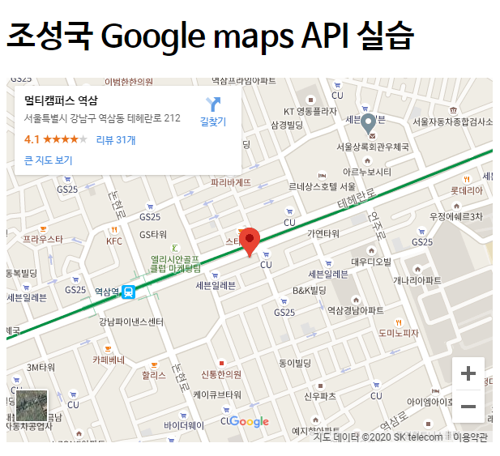

# 2nd_week_quiz (조성국)

## 1. 다음 중 웹에서 실시간 소통 네트워크 기술의 발전을 순서대로 올바르게 나타낸 것은? (1점)

1. websocket -> streaming -> long poll -> poll
2. polling -> websocket -> streaming -> long poll
3.  polling -> long polling -> streaming -> websocket
4.  streaming  -> websocket -> poll -> long poll


## 2. 다음 중 폴링 방식에 대한 설명으로 옳지 않은 것은? (1점)

1. 클라이언트 수가 많아질 수록 부담이 계속해서 가중된다.
2. 기존의 http request 방식을 넘어선 실시간 네트워크 통신 기술이다.
3. CLIENT가 주기적으로 SERVER에게 요청을 보낸다.
4. SERVER는 CLIENT에게 RESPONSE를 주면서 Connection을 끊는다.


## 3. 다음 모식도는 실시간 네트워크 기술 중 어떤 방식을 표현한 것인가? (1점)


1.  websocket
2.  poll
3.  streaming
4.  long poll


## 4. websocket 방식의 문제점과 그것을 해결하는 방법을 간단히 서술하시오. (2점)

 ```text


 ```


## 5. 왜 기업은 API를 open 하는가? (1점)

```text


```


## 6. REST API의 가장 주요 특징 2가지는? (2점)

-  
-  


## 7. 구글 maps API 사용해보기 (2점)

- 간단한 html 파일은 만들고 아래와 같은 이미지를 카톡방에 제출

