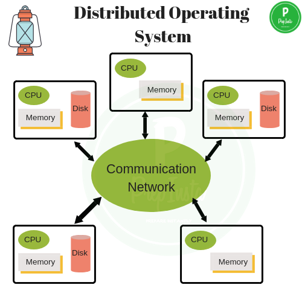
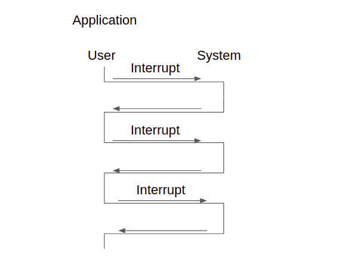
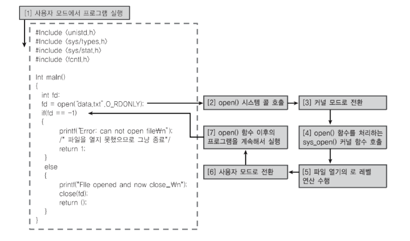

[TOC]

# 운영체제(Operating System)

> 컴퓨터 자원, 즉 하드웨어를 효율적으로 관리하여 사용자 또는 응용프로그램에게 서비스를 제공한다.

### 하드웨어와 운영체제

- CPU에게 처리할 작업**(프로세스)** 할당 및 관리
- 주변 장치 사용을 위한 인터페이스(API) 제공 = 드라이버
- 주변 장치의 입출력 관리
- 파일 및 디스크 관리
- 기타 등등

[하드웨어와 운영체제](https://www.youtube.com/playlist?list=PLBrGAFAIyf5rby7QylRc6JxU5lzQ9c4tN)

### 운영체제의 발전

- 1 CPU - 1 JOB
- Batch : 일괄처리
- Multi-Programming : 순서대로 진행
- Multi-Tasking (Time-Sharing) : 순서대로 빠르게 진행
- 고등 운영체제

## 고등 운영체제

> 다년간의 발전을 거쳐 현재 주로 사용하는 운영체제

### 다중 프로세스 (Multi-Processing)

두 개 이상의 CPU를 갖고 한 번에 여러개의 프로세스를 처리한다.

- **스루풋(Throughput)** 상승
- 높은 성능과 신뢰도
- 적은 비용
- 병렬 컴퓨팅 (Parallel Processing)

#### 비대칭형 다중처리(Asymmetric Multi-Processing : ASMP, AMP)

CPU의 구조가 Master(1개) - Slave(나머지) 관계로 되어있다.

Master CPU의 할당으로 작업이 이뤄진다.

![img](data:image/png;base64,iVBORw0KGgoAAAANSUhEUgAAAWcAAACMCAMAAACXkphKAAABIFBMVEX////y+fJRk1F+sH7b5dv89vb/+/vUYWHntbXmpaXZ5dmhwKH7/Pv2+/bz19cAAABpoGnRWlqCsILbgoJxo3FXlVe10bUAXQAAdADz+vMAcADzzs7FAADo7+g9iz1spWxcolx9fX309PTa2trZ7NkAfAC8AADV1dXk5OTq9erH3scSfRLPNDT77e22trZISEh1dXXMGhpkZGRSUlLLy8sAaQAAWwCXw5cyMjKZmZmhoaGJiYlAQECvr69QUFC70bvdkJD54+Porq7hjY3NPj5eXl6v0K+gx6DR5NFMmkw3jjfSTEzQLS3fenrwxcXIFBR3GRnKh4eUTU1fAAAeHh4qKioSABI1LjUifSI5kDm92r1hpGGJvIl0tHSKwYosjCyJC4lAAAAKp0lEQVR4nO2be0PayBrGJyJWaAJVtxC5CEZSTMJVpfGCchGBgLZ7ztnuUaDL9/8W+04A7YWEBJJRYJ4/ADPJvJlfZp65ZESIioqKioqKioqKioqK6kVbXjJ67XK+sryZd0RUDLx2SV9X3p0tEkJ7a8+ZTBzKmUwcyplMHMqZTBzKmUwcyplMHMqZTBzKmUwcyplMHMrZLLE2XpbYyk5bn5h60ECUs0liNNaN4u+t25hv2qV163EoZ5PE6NfMHv4OZL5O45zZth6HcjZJjMZu7/G37yGDOUerVV8NvrO+qi+LstXiu/roD/APr69Wr5qwpJxNEqOx7XtsHI0v98D59uvOzn0xgGqZxk4mU8vuxBp7KFps7DSKNZRtdBs7lLOhZnAOvKuCbTSyRR+qxaD2BopVVM14Ue1rFW1lviDUffAi78M7lO12s2ZxKGeTxGisVgd8t7dbxZE/ewONW1SP3QYw0yz4c7S4XQvU6ve1LCSYiXI2SQTO2VjAC4MOzLl2+9CNxfaQdy/2KbOX1Tlvxz5hxaLZxpSe8gdRziaJ4BuoUY1mEK7PgVj3th5o4AHI1vZDsevFnL/cj/lRzuaaybnare7pnLEto1pxb6uOidZjWTyuq+kD60A1SzmbaybnaLEY1Tlvx6qB+j34Bv7xJfOAvPcP8BjwUThIOZtrJudso5FF3lgVTwo/ZaIPDS/U5U+xB+gJq5/uvV4f/HHrRdn7qmkcyplMHMqZTBzKmUwcyplMHMqZTBzKmUwcyplMHMqZTJy159zdJqLuunOu+6brzz8NEny+//zXMOV/hkmmq9Nrq1z5mjVMPLoyTBIOy2k37mc1dXxycmSSnDbmDNfmTwSn72c1xV6Wr01PMOUMbeH8gpKerfTp4QxMMzgj4eIm59z9rKaEw/xMg53FGRz85ITatJly+cvZbT59OPMUNpen5mEoqIbHFk6zwBlIX5WpeUyVcJm3RsYSZzxquTMbtayrzvKz+r+JjqxxhizLV9Q8fpZweGq58lnmjJuIyXxnDXV9boOHdc5gHoXTsznuZzV1fFew0v9NZIczmMfdoZ3MV1gXFvu/iexxRuiyfGnvgpXU2andzsouZ2z+624e8yCwzRk/TFvOtGpir+dp0nNwhp52jSeIR3eW5n+/XTYPZyRc5dfTPISLOQs+H2fL0/oV01l+3snavJzxa5qZS30rpuPC3dx1a37OuA3l1mmCaGv+96sW4IxQeo3M4yhfWKTvX4jzIoa1ZLoqL9bxL8gZzON8DZamc+WLBR1yUc5AupBf8aVpwYH1s8U546Xpwgr3hyz0f4vncuwAZ9wVW3gVuZw6PnWkr3eGM2Rzs5IvxYUrh/ZkOcQZxng3K7i6dFZ2aiHHMc7gY98c8LG3pEXmf7/n5VROoMPzVTKPheZ/v8pRzqu08fGovND871c5y3l1Nj461f9N5DRnmCCuwN6l3PmlwzMCxznrO66X26aFgvMFcIGzvhywvOYxc8v4XHKFM7a3ZTWP9J2j/d9ELnFe1o2Prr34dIuznb2Ub0fu7fR2j7O+8dG1zN3QUcG910MucsYbd26WZ/sB3jLu3vKuq5yXaeNj+sZVm3OZs77xcQleAghXLq/rus55KTY+Oj//+1Xuc9aHpG/aPI5P3L8/Epzf+H/GEVmQIcL5La8u2d8yPpcIcX57Gx8FnS70fwQ6j/Q1KxTQEaHZRG68d0l4ExZyjUudyxP5LxA2/+3ipBAkNRwYb3x07pXkAhKCFwSb2FkQdEJufHtUuEujY2IP1kSHwcIlub3y7ClwJlrqs5urXPCvV3eOdDD4F8kdmLlg8IZcNCzh+jwYfPUd6mWoX99I7t4+DRJ+xyQcBkm3od91ie/h778J/ivk2R25WFjpPC5i8P9bjuXIbxDR40tEjkzEjUf/TwVlPWTCHoSmYWY/7DO2tT+W9QuYjy8mw32cJ6T9K3Z/5ow+SDZu2G4Jn8WF3k/l/Me8DcGWuJ84EwmJfuPMEAlLOceJhKWcKWdXRDkTCUk5U86uiXKmnB0W5Uw5u6Kl4Rx6Cod5j4RQqiTPzl8Sm8aJVjn7k6XPpT5Ekx4HswLKnXBYaxun2+AseSLh0lOPRWxfmxVWSpbCmt843TbnHu/x+0OKJqEUP5szk+SnLqCMZJFzapiU/W2NTyHpQJ0RMCX2/e2hYjyZts6Z05SKv52INBGbSM4Iy2gdua11JMMT7HLmPvbxlxRpjTgzcqUCtSclY2Jt+OTkijwpJRsSD5TFOauifsJBf8y5XalAIKmCw+ifcGBSQs8Th2EbNyLrnGV4sDhHkRtxTlUqEIzTQ+mfcCA1Pte/K2EoPcOwtjn3k5yecVznzByIkYjShFoOEdlkgpUSfITfGIdntGbKCc68/uDimzpnzgMh+V02pWCY6pBhVTjwOC5iHGOTOi3DzGxwjujtlfGzOueWEolE+tK+hq1L5v2oCQeUH9uXWQO37RsyL6qVNjvOtg9NhdVExOKAKaWHEp0UYvoaNzldcoCz9BRJVGScJebcikD7GcDH9wS0noMBaok9xKpK6uWCJm/cgK1zZvulfkjGOWHO7VILZ9xELewOCQ2Kr+IDz1XY/35o/HTn6Af9HpFXDpojznFc01SRQ4MneOJDjhFDiEVt8bkwTtRnxKhDXgSiOme9xrb5NuqJEkRKIc3DsiwzfLEKSTHpLW30g1yow/Md6PIxZ2ZTz7kFPXsP7YMxDTYYluUSnsnZA1FJGHcLc43rpOYfE3/uvU8MS1B92kobPQ1QKlIKg0rPT9kRzqD93i4ProT9uf1+V4uAFXJQfwYay3RGIZ/ZysquyTtKm+M6WX3sMLpvSCE1yUcgfj+Bmo8Sm9DDhpPPTRcxnb5hPnY5p7RR+0w+6ZxVfthv7QJnLqmmxDYcC8U3N+Px5+AOcGa1UVVtKRIDnEOKklSbuMtRNWzEzHAXQm7GJ3WpJ5qO/SxzZj2qfnc9RUbA2T9UtEEI2yO0o8R3qOP9TRx2dDnLje7Q8AHb5Swpo4aSxAYlS3pflMB22NS+b+wjRsQdA9N8bkBO1GdtqH+NOT/hStPELabd+ecRnrqGD7ChMT9VNO70sazXZ1XUq5Q84uzp4IEM9mSpM4COCA30UZw86vpCJTxk9wwNw9r2jRaf8AtxD3QImPMwEY8PRMxZEnncDQz4JufXnhzlLItJWWBUqKfYN2CUyrWGuD6zSR4j7kU88bhHHM1NemKTFQSOM8zMOmdJ6TQZrjfU9PHGQJQ5uYN9A34OOVxgTRLUyKitSdpBm2tFjDtC+/7cPIDJWSc0mg/2+HAp0dQHQIkIfvycCkf6L2VJ8Q7MB9sfI5/DuMlKjypqw3xU6+ntphnWM28q4XBnVK8YTXfNz98N87Lhz34PP5r64vkg0y+FhyG9MaVKepuWtfBnZULWv1EKwyM2zGuOfpCLx3UzZLELw28W6XbMjW84/oM7j08yzMlqP/gSEj4ZHGD85+h6Jj5xZzY+khPzwXFu+Af+5HCuzOhPbnJXL3E4s6B0HentriM5KMqZcnZYlDPl7IooZyIhKee13F/3cXPT77o2/Qc/cN7wb5LQh185t4mEbU3ljN4T0ktERvWQ0c9L02yTUFgL71KpqKioqKioqKioqKioVlv/AuB1kEtFL312AAAAAElFTkSuQmCC)

#### 대칭형 다중처리(Symmetric Multi-Processing : SMP)

모든 처리장치가 동등하다.

모든 CPU든 어떠한 프로세스라도 가능하다

모든 CPU는 메모리, 입출력, 기타 하드웨어 접근 권한을 갖는다.

### 분산 처리 (Distributed System)

> 물리적으로 분산돼있으나 네트워크로 연결되어 있는 컴퓨터로 여러개의 처리를 한다.
>
> ex) SETI@home

- 작업이 분산되므로 메모리 부하가 적다
- 컴퓨팅 속도가 상승한다
- 특수 하드웨어가 필요할 경우 하나의 컴퓨터에 해당 하드웨어가 없어도 처리가 가능하다
- 특정 데이터에 대한 접근이 원활하다

##### 느슨한 결합 vs 단단한 결합 (Loose Coupling vs Tight Coupling)

> 다중 프로세서는 강결합, 분산 시스템은 약결합이다.

- 느슨한 결합(a.k.a. 약결합)
  - 의존성이 낮으며 메모리 공유가 없어 각자 자신의 작업을 수행하면 된다.
  - 하지만 서로가 서로에 대해 잘 모르기때문에 문제가 생겼을 때 해결이 늦을수 있다.
- 단단한 결합(a.k.a. 강결합)
  - 서로 단단히 붙어있기 때문에 빠른 문제 해결과 처리 분산이 가능하다.
  - 의존성이 상당히 높으며 하나의 문제가 전체의 문제를 야기할수 있다.

#### 클러스터 시스템 (Clustered System)

> 분산 시스템의 한 종류로 개별 컴퓨터가 LAN으로 연결돼있다.

모든 컴퓨터(노드)가 서로를 지켜보고 있으며 작업을 나눈다.

이로 인해 하나가 문제가 생기면 다른 노드가 처리할 수 있다.

### 실시간 시스템(Real-time)

> 어떤 작업이 시간내에 반드시 끝내야하는 시스템, 실시간 시스템이라 한다.

- 시간제약: Deadline. 시간내에 반드시 끝나야하는 시스템. 그것을 지나가면 실패한 시스템이라 한다.(타이트한 시간제약)
  - 공장 자동화(FA), 군사, 항공, 우주

#### 경성 실시간 시스템 (Hard real-time system)

작업의 실행 시작 및 완료 시간이 굉장히 엄격하여 시간을 지키지 못하는 경우 치명적인 영향을 주게 된다.

#### 연성 실시간 시스템(Soft real-time system)

시간 제약은 존재하나 지키지 못하더라도 큰 영향은 없다. 예) 프린터

### 인터럽트 기반 시스템(Interrupt-Based System)

현재 우리가 사용하는 운영체제는 전부 인터럽트 기반이다.

컴퓨터의 부팅이후 운영체제는 메모리에서 **인터럽트**를 기다린다.

#### 외부인터럽트 - 하드웨어 인터럽트

ex) 마우스, 키보드, ...

#### 외부인터럽트 - 소프트웨어 인터럽트

ex) 프로그램 실행, 프로그램 내 입출력, ...

#### 내부 인터럽트

ex) divided by zero...

## 이중모드

현대의 컴퓨터는 서로 연결돼있는 경우가 많고 사용 환경 역시 다양하다.

때문에  누군가의 고의 또는 실수로 다른 프로그램 전체가 영향을 받을 수 있는 환경이 만들어진다.

이를 방지하기 위해 운영체제는 **관리자모드(Kernel Mode)**와 **사용자모드(User Mode)**를 운영한다.

- 사용자 모드 : 일반 명령 수행과 인터럽트 입력을 처리한다
- 관리자 모드 : 일반 명령과 인터럽트는 물론이고 특권명령도 수행할 수 있다.
  - 특권 명령 : 입출력 제어, 타이머 관리, 인터럽트 처리, ...

### 하드웨어 보호
> 운영체제는 이중모드를 이용해서 하드웨어를 보호한다.
> 

#### 입출력 보호

다른 사용자와 동시 사용하는 것을 막기 위해 입출력 명령을 특권 명령어로 하여 IN, OUT 이라는 명령어가 존재한다

입출력 요청(사용자) -> 관리자모드로 변경 -> 입출력 확인(관리자) -> 입출력 실행(관리자) -> 사용자모드로 변경

ex) 프린터 제어, 파일 생성, 수정, 삭제, 읽기, ...

#### 메모리 보호

다른 사용자가 메모리 또는 운영체제 영역 메모리를 접근할 경우를 막기 위한 작업이다. 특히 해킹에 관련된 부분이 많이 작용을 한다.

이를 제어하기 위해 **MMU(Memory Management Unit)**를 두어 다른 메모리 영역 침범하는 것을 감시하는 장치를 놓는다.

- 메모리 관리 장치(MMU) : **CPU가 메모리에 접근하는 것을 관리하는 하드웨어 장치**로 메모리 주소 할당, 보호, 관리 등 CPU에서 메모리로 접근할 때 작업을 수행한다.

ex) 메모리 해킹 방지 : 키로거, 정보탈취 방지, ...

#### CPU 보호

한 사용자가 CPU 시간을 독점하게 되면 다른 사용자는 프로그램 실행이 불가능하다.

운영체제는 Timer를 두어 일정 시간 경과시 타이머 인터럽트를 발생시켜 운영체제가 다른 프로그램으로 강제 전환하는 방법을 취한다.

ex) max recursion, DoS(Denial Of Service), ...

[운영체제의 종류(영어)](https://www.youtube.com/playlist?list=PLRJP-g0nSX0e0kgIW6bom0kQtx4dyHyZx)

[운영체제 블로그](https://copycode.tistory.com/39?category=740133)

[운영체제의 역사](https://opentutorials.org/module/2974/17297)

