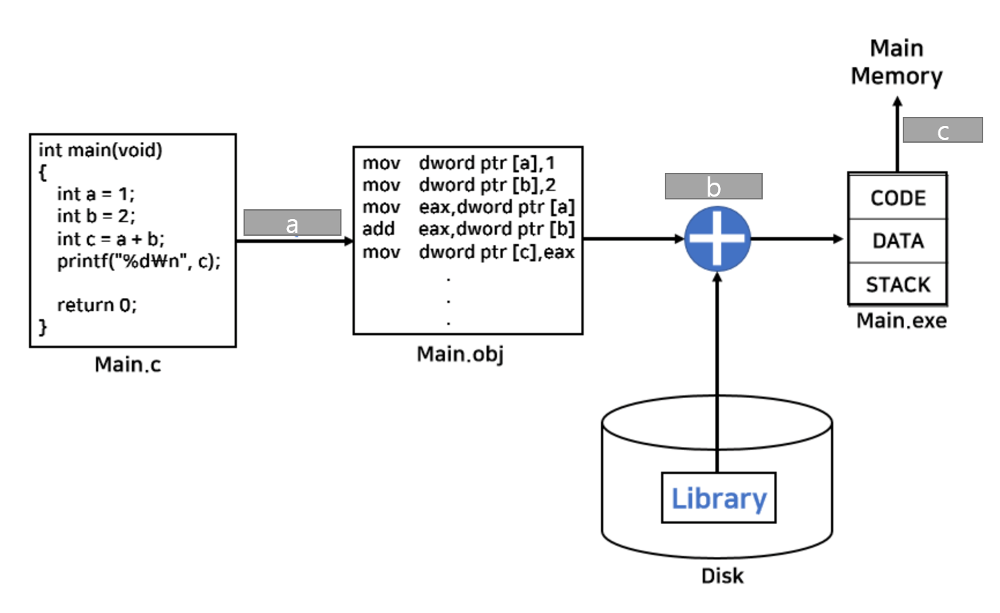

# 8week-quiz answer

## 1. 만약 아래와 같은 코드가 실행되는 프로세스가 있다면 다음 코드 내 A, B, C 영역은 메모리 영역 중 어느 파트에 해당하겠는가?

```python
# randomNum이 짝수면 trueOrNot이 1, 홀수면 0

import random
arrRange = [1, 2, 3, 4]					# A

randomNum = random.choice(arrRange)		 # B
if randomNum % 2 == 0:					# C
    trueOrNot = 1 
else:
    trueOrNot = 0

```

**[heap/stack, code, static data]** 

- A: static data
- B: heap/stack
- C: code


## 2. T/F

- Compile할 때 address binding 하는 방식으로는 multiprogramming이 어렵다.
  - T
- 실행할 때 address binding을 하는 방식을 사용할 때는 MMU라는 소프트웨어가 필요하다.
  - F. MMU는 하드웨어이다.
- 예외 상황이 자주 발생하지 않는다면 dynamic loading 방식을 사용하는 것이 메모리를 효율적으로 활용하는 방법이다.
  - T
- 컴퓨터를 오래 사용하지 않고 있으면 dynamic linking을 쓰는 것이 메모리를 효율적으로 쓰는 방법이다.
  - F. swapping으로 사용하지 않는 메모리를 backing store(하드디스크)로 내보내는 것이 효율적인 방법이다.
- 물리 주소와 논리주소는 같을 수 없다.
  - F. 같을 수도 있다. 방식에 따라 다르다.


## 3. 다음 a, b, c 빈칸에 알맞은 것은?



- a: compile
- b: link
- c: load