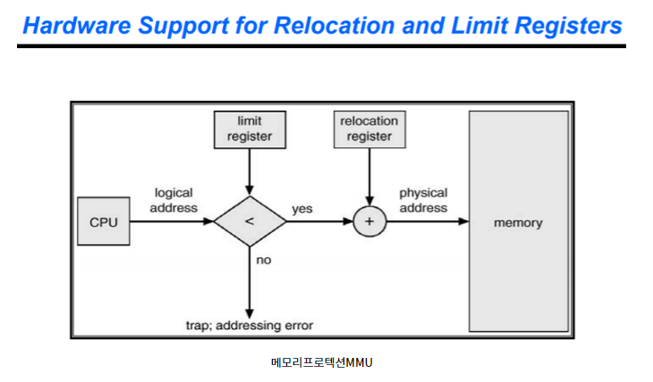
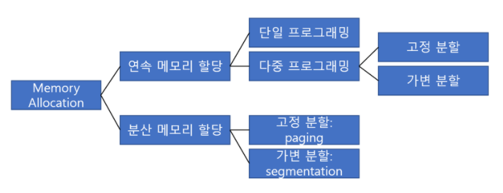
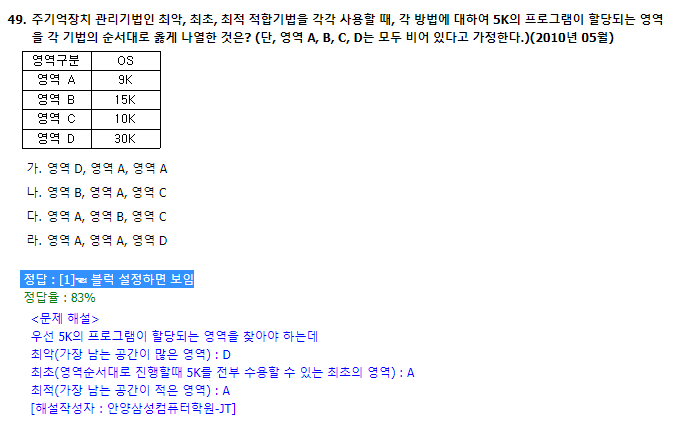
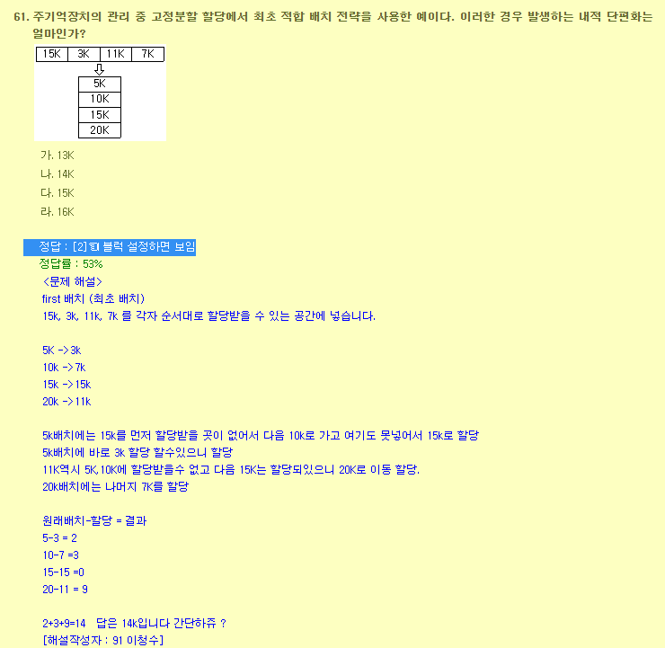
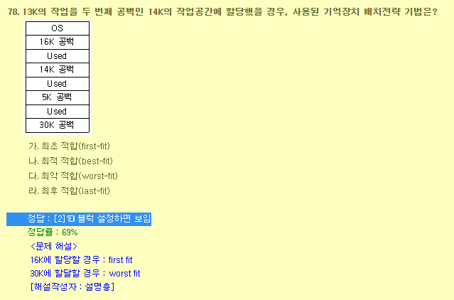
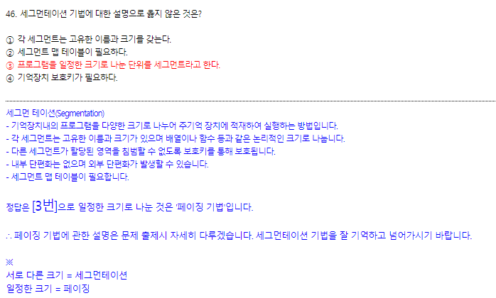

# 8week- Main Memory Management

#### 운영체제의 기능:

* CPU 관리 - CPU Protection
* I/O 관리 - I/O Protection
* memory 관리 - memory Protection
  * **Base register**는 프로세스의 starting address를 지정해준다.
  * **Limit register**는 relocation register로부터 접근 가능한 offset을 제한한다.
    * 상한 레지스터보다 가상 주소 값이 크면 **memory protection fault** 발생

##### CPU에서 메모리 자원은 중요한 관리 대상

##### ⇒ 메모리 할당에 대해 여러가지 접근 방식이 등장한다!

- [ ] 무엇을 적재할까?
- [ ] 어떻게 적재할까?
- [ ] 어디에 할당할까?

---

# 메모리 분할

1. 연속 메모리 할당
   * 외부 단편화
2. 분산 메모리 할당
   * 내부 단편화

## 연속 메모리 할당(contiguous allocation) 

### 다중 프로그래밍 환경

* `big single hole` to `scattered holes`
  * 메모리에는 O/S와 프로세스가 탑재된다.
  *  부팅 직후, 메모리 공간에는 오직 O/S만 존재한다.
    * 이때 O/S는 메모리의 가장 하위 레벨low level 에 배치하고 그 위로 프로세스를 배치한다.
      * low level에 배치하는 이유:
  * 단일 프로그래밍 : single hole에 하나의 프로세스만을 탑재한다. 문제 없음!
  * 다중 프로그래밍 : single hole에 여러 개의 프로세스를 탑재한다.
    
    * 이용 가능한 memory block으로 여러 프로세스가 할당되고 해제되면서 다양한 사이즈의 block(=scattered holes)들이 생성된다.
    

### 가변 분할 다중 연속 메모리 할당(Multiple-partition allocation)  

1. #### 최초 적합(FIRST-fit)

> 메모리를 순차적으로 탐색하다가, **가장 처음 발견되는, 가능한 공간hole**에 프로세스를 배치한다.

   * hole들은 주소 순으로 정렬되어 있다.
   * 가장 빠른 속도로 할당이 가능하다.

2. #### 최적 적합(BEST-fit)

> **프로세스와 hole의 크기 차이가 가장 작은 공간**에 프로세스를 배치한다.

   *  전체 공간을 모두 서치하거나 / free hole들을 size에 따라 오름차순으로 정렬하여, linked list 구조로 관리한다.
   * 매우 작은 자투리 공간들이 생겨난다. 

3. #### 최악 적합(WORST-fit)

> **프로세스와 hole의 크기 차이가 가장 큰 공간**에 프로세스를 배치한다.

   * 전체 공간을 모두 서치하거나 / free hole들을 size에 따라 내림차순으로 정렬하여, linked list 구조로 관리한다.
   * 큰 자투리 공간들이 생겨난다.

### 메모리 단편화(Memory Fragmentation)

> Hole들이 불연속하게 흩어져 있기 때문에, 충분한 가용 공간이 있음에도 불구하고 필요한 프로세스를 적재할 수 없는 상태

#### 외부 단편화 External Fragmentation

* 배정되지 않은 메모리 공간들이 단편화되어 비효율을 발생시키는 상태

  :bulb: **50%의 법칙**

  : 전체 메모리 공간의 1/3이 낭비된다. N개의 블럭이 할당된다면, 0.5N 개의 블럭은 손실되는 것. (50%)

* Compaction(압축)

  * 작은 공간들을 모아서 연속적인 공간들을 만드는 작업. EX 디스크 조각모음!
  * 항상 가능한 것은 아님: 
    * 재배치가 동적으로 수행되고, 
    * 주소는 Relocatable Address여야 하며, 
    * Execution Time Binding이어야 가능하다. 
  * 비용이 많이 든다.

* 메모리를 연속으로 할당하는 경우에 발생하므로, 한 프로세스의 논리 주소 공간을 여러 개의 비연속적인 공간에 할당하는 방법을 도입하여 해결하고 있다!
  ⇒ 분산 메모리 할당 도입!

#### 내부 단편화

* 이미 배정된 메모리 공간 내에서 빈 공간이 발생하여 비효율적인 상태

  ⇒ 고정 분할 분산 메모리 할당에서 발생!

## 분산 메모리 할당(N0n-Contiguous allocation)

### 고정 분할(Paging)

* **Frame**: 물리적 주소 공간을 고정된 사이즈의 블록으로 나눈 것. 메모리의 단위 - 메모리는 프레임의 집합!

* **Page**: 논리적 주소 공간을 고정된 사이즈의 블록으로 나눈 것. 프로세스의 단위 - 프로세스는 페이지의 집합!

* **페이지 테이블**: 

  * MMU 내의 재배치 레지스터 값을 바꿈으로서, *페이지를 프레임에 할당한다*.
    * 이 때 MMU가 페이지 테이블이 된다.
    * 시작 지점만을 저장하므로, 1차원으로 구성된다.
    * 통상적으로 프레임의 단위는 4KB를 채택한다.
  * CPU는 프로세스가 연속된 메모리 공간에 위치한다고 착각한다!
    * 페이지 테이블은 연속된 주소 공간이며, logical address는 연속되어 있되 physical address는 불연속한다.

* 내부 단편화 발생

  * 프로세스의 크기가 페이지 크기의 배수가 아니라면, 마지막 페이지는 한 프레임을 다 채울 수 없다.
  * 1byte를 위해 하나의 프레임을 할당하는 worst case 발생 가능

* **보호Protection** 

  * 모든 주소는 페이지 테이블을 경유하므로, 페이지 테이블 엔트리를 보호하는 방식으로 해당 페이지에 대한 접근 제어 가능
    * 페이지 주소 끝에 `r`, `w`, `x` 비트를 붙인다! 

* **공유Sharing** 

  * 같은 프로그램을 쓰는 복수 개의 프로세스가 있을 때, code/data/stack 중 code는 공유 가능하다!
  * 프로세스의 페이지 테이블 코드 영역이 같은 곳을 가리키게 하며 메모리 낭비 방지 가능

  

### 가변 분할(Segmentation)

* **segment**: 프로세스를 논리적 내용으로 분할해 메모리에 배치 = 프로세스는 세그먼트의 집합!
  * 세그먼트의 크기는 일반적으로 같지 않다. 따라서 페이지와 다르게 미리 메모리를 분할해둘 수 없다.
  * 사용자 관점에 맞춘 가상 메모리 관리방법!
* **세그먼트 테이블**:
  * MMU 내의 재배치 레지스터 값을 바꿈으로서, *세그먼트를 메모리에 할당한다*.
    * 이 때 MMU가 세그먼트 테이블이 된다.
    * 페이지 테이블과 다르게 limit(offset) 값도 함께 저장한다. 따라서 2차원 배열로 저장된다.
  * CPU는 프로세스가 연속된 메모리 공간에 위치한다고 착각한다!
* Segment-table의 시작 주소(segment-table base register)와 끝 주소(segment-table length register)를 저장한 레지스터가 필요하다.
  * 이 때, 세그먼트 테이블 레지스터를 통해 세그먼트 테이블에 접근 / 세그먼트 테이블을 통해 메모리 공간에 접근하며, 메모리에 두 번 접근해야 하기 때문에 기존의 MMU보다 느리다.
  * 여전히 외부 단편화 발생 가능!
* **보호Protection** 
  * 모든 주소는 세그먼트 테이블을 경유하므로, 세그먼트 테이블 엔트리를 보호하는 방식으로 해당 세그먼트에 대한 접근 제어 가능
    * 페이지 주소 끝에 `r`, `w`, `x` 비트를 붙인다!
  * 중요에 따라서, 용도에 따라서 나눌 수 있다 - 페이징보다 우월!
* **공유Sharing** 
  * 같은 프로그램을 쓰는 복수 개의 프로세스가 있을 때, code/data/stack 중 code는 공유 가능하다!
  * 프로세스의 세그먼트 테이블 코드 영역이 같은 곳을 가리키게 하며 메모리 낭비 방지 가능
  * 논리적 단위에 따라서 나눌 수 있다 - 페이징보다 우월!

#### paged segmentation 세그먼트 + 페이징

* 대부분의 운영 체제는 페이징을 사용한다:
* 세그먼트를 페이징 할 수 있다!
  * 세그먼트는 보호와 공유에 효과적, 
  * 페이징은 외부 파편화 관리에 효과적이므로

https://jhnyang.tistory.com/284?category=815411

https://velog.io/@doyuni/%EC%9A%B4%EC%98%81%EC%B2%B4%EC%A0%9COS-8.-Memory-Management

https://www.slideshare.net/ShahzebAmjad/first-fit-best-fit-worst-fit

-----

![image-20201015184241735](Main Memory Management II.assets/image-20201015184241735.png

