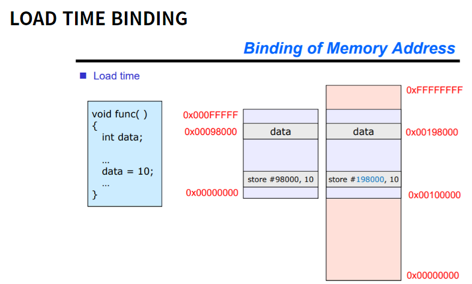

# 8week- Main Memory Management

---

[toc]

## 1. 프로그램 실행 process


1. Source file(Main.c): 개발자가 작성한 코드
2. Object file(Main.obj): 작성한 코드를 Compile작업(high level language에서 low level language기계어로 변환)한 파일
3. 실행(Main.exe)
4. Link: 프로그램과 라이브러리를 연결하여 실행파일을 만든다.
5. 적재(Load): 프로그램을 실행하여 CPU process를 돌리기 위해 메인메모리에 올리는 과정.


## 2. 메모리 

### 01. 메모리 주소와 데이터

#### Address binding

> 메모리 주소 값을 할당하는 것.

- 언제(timing) address binding을 하냐에 따라 크게 세 가지로 구분된다. (compile time / load time / execute time)	

#### type1. compile time


- 컴파일 할 때 binding
- 프로그램 내부에서 사용하는 가상주소와 메모리의 물리적 주소가 같다.
- 따라서 해당 주소값을 dynamic 하게 변경할 수 없고 반드시(absolute) 해당 주소값에 메모리를 올려야 하므로 여러 프로세스를 동시에 사용하는 현대의 프로세스 방식과는 잘 맞지 않는다.
- 때문에 현재 대부분의 pc에서는 사용하지 않고 아두이노, 라즈베리 파이 등 소형 임베디드 시스템에서 활용된다. 

#### type2. Load time



- memory에 load할 때 binding
- load 시 메모리의 어느 공간에 넣을 지 정하고 가상 주소에 얼마를 더해서 실제 physical 주소에 할당할지를 결정함
- 위의 예에서는 데이터 10이 가상주소 98000으로 설정되어 있지만 실제 물리주소는 198000에 있다.
- 때문에 프로그램 내부에 작성되었던 모든 데이터들에 +100000 씩 해줘서 주소를 할당해줘야 한다.
- Compile시가 아니라 이렇게 Load시에 address binding을 하게 되면서 드디어 Multiprogramming이 가능해졌다.
- 하지만, load시 모든 데이터의 주소를 binding 해야하기 때문에 로딩 속도가 올라가는 단점이 있다.

#### type3. Execute time

- 실행할 때 binding

- 실행할 때 마다 address를 binding하고 이 binding 규칙을 `하드웨어`를 통해 기억하게 하는 방식이다.

- 이때 활용되는 하드웨어를 `MMU` Memory Management Unit(메모리 관리 장치)라 부른다.

- [**MMU (Memory Management Unit)**](http://recipes.egloos.com/5232056)

  >  CPU와 메인 메모리 사이에서 **CPU**가 **메모리**에 접근하는 것을 관리하는 컴퓨터 하드웨어 부품이다. 가상 메모리 주소(Virtual Address)를 실제 메모리주소(Physical Address)로 변환하는 역할을 한다.

  

- MMU는 multiprogramming시 간단하게 프로그램에 내장되어 있는 virtual address를 그대로 두고 CPU가 이것을 메모리에 저장하려고 할 때 해당 프로세스별로 +α 값을 설정하고 기억하고 있는다. 이후 해당 메모리 주소값을 불러올 때는 이 α값을 연산하여 물리 주소에 접근할 수 있도록 한다.

### 

#### 논리주소 (logical address) vs 물리주소(physical address)


- 일반적으로 CPU가 생성하는 주소를 `논리주소(logical address)`라고 하고 메모리가 취급하게 되는 주소를 `물리적 주소(physical address)`라고 한다.
- 앞의 연계 분류에서 언급했던 컴파일과 적재 시 연계 기법의 경우에는 논리 주소와 물리 주소가 같다. 그러나, Exectue(실행 시간) 바인딩 기법에서는 논리 주소와 물리 주소가 다르다. 이러한 경우에는 논리 주소를 가상 주소(virtual address)라고 한다.
- 프로그램에 의해 생성된 모든 논리 주소 집합을 논리 주소 공간 (logical address space)이라 하며, 이 논리 주소와 상응하는 모든 물리 주소 집합을 물리 주소 공간(physical address space)이라 한다.
- 프로그램의 실행 중에는 이와 같은 논리 주소를 물리 주소로 변환해야 하는데, 이 변환(mapping) 작업은 하드웨어 장치인 메모리 관리기(MMU - Memory Management Unit)에 의해 실행된다. 이 메모리 관리기를 통한 다양한 메모리 변환 기법들이 있는데, 그 중에서도 가장 간단한 기법이 바로 재배치 레지스터를 이용하는 기법이다. 재배치 레지스터 기법에 대해서 언급하기 전에, 기준 레지스터에 대한 개념을 알아보도록 하자.
- 각 프로세스가 실행 될 때, 하나의 프로세스가 다른 프로세스의 주소 공간으로 접근하지 못하게 하기 위해서 "기준 레지스터(base register)"와 "상한(limit)"이라고 불리는 두 개의 레지스터를 사용한다. 기준 레지스터는 가장 작은 합법적인 물리 메모리 주소의 값을 저장하고, 상한 레지스터는 해당 프로세스에게 주어진 영역의 크기를 저장한다. 예를 들어, 만약 기준 레즈스터의 값이 300040이고, 상한 레지스터의 값이 120900이라면, 이 프로세스는 300040 부터 420940까지의 모든 주소를 접근할 수 있다.
- 메모리 공간의 보호는 CPU 하드웨어가 사용자 모드에서 만들어진 모든 주소와 레지스터를 비교함으로써 이루어진다. 사용자 모드에서 실행되는 프로그램에 의해 운영체제의 메모리 공간이나 다른 사용자 프로그램의 메모리 공간으로 접근이 일어나면, 운영체제는 치명적인 에러로 간주하고 트랩(trap)을 발생시킨다. 아래 이미지가 나타내는 것이 바로 이 메모리 공간 보호 과정이다.


## 3. 메모리 관리 (절약)

> 컴퓨터의 메인 메모리는 굉장히 소중한 자원이었다. 따라서 이 메모리를 가장 효과적으로 사용하는 것이 OS(운영체제)에서는 매우 중요한 일이었다.
>
> 메모리 관리(Memory Management)는 어떻게 컴퓨터가 메모리를 최대한 효율적으로 쓸 수 있는지에 대한 여러가지 방법을 보여준다.


### 01. 동적적재(Dynamic Loading)

> 메모리 공간을 효율적으로 사용하기 위해 프로그램 실행에 반드시 필요한 루틴/데이터만 적재하는 것.
>
> 필요한 것(함수, 데이터 등)만 메모리에 Load하고 나머지는 Load하지 않으면서 변화하는 환경에 따라 dynamic하게 메모리에 load 한다.

- 메모리의 효율성을 높인다.
- 예전에 메모리 용량이 부족하여 소중했을 때는 반드시 알아야 했으나 요새는 잘 신경쓰지 않는다.
- 주로 error 혹은 예외 처리 시 많이 활용했었다. 예를 들어, error나 예외 상황이 간혹 발생하는데 이 부분에 대한 처리 코드 내용이 굉장히 길다면 이 코드 내용까지를 굳이 포함하여 한 번에 메모리에 올릴 필요는 없고 만약 이 상황이 발생하면 그때 load해서 사용하는 것이 메모리 관점에서는 더욱 효율적일 것이다.

### 02. 스와핑(Swapping)

> 메모리에 적재(Load)되어 있으나 현재 사용되고 있지 않는 프로세스 메모리를 관리하는 것.
>
> 현재 사용되지 않는 프로세스를 backing store(하드디스크)로 몰아낸다. 

- dynamic load와는 무슨차이가 있을까?
  - 저장 위치가 모두 hard disk라는 점에서는 공통적이지만 swap in은 적재되었다가 빠져나온 것을 backing store에 보관하고 있다가 다시 메모리로 swap in 하는 것이지만 dynamic load에서 호출되어 load되는 것은 backing store가 아닌 프로그램 저장 공간 내에서 한 번도 load된 적이 없던 것이 memory로 load된다는 점이 다르다

### 03. 동적 연결 (Dynamic Linking)

> 여러 프로그램에 공통 사용되는 라이브러리를 관리하는 방법.
>
> 여러 프로그램에서 공통적으로 사용되는 라이브러리가 있다면 공통 라이브러리를 메모리에 중복해서 올리는 것 보다는 공통 라이브러리 루틴을 하나만 연결하여 사용하는 방법이다.

```python
# ab.py
print('Hello world!')

# cd.py
a = 3
b = 2
print(a*b)
```

- 위 `ab.py`와 `cd.py`라는 파이썬 프로그램이 동시에 실행된다고 할 때 두 프로그램은 모두 `print`함수를 공통적으로 사용하고 있다. 이 경우 두 프로세스의 메모리에 모두 print 함수를 로드할 수도 있지만, 어차피 공통적으로 쓰이므로 하나만 memory에 load하고 같이 활용하도록 하는 방법이다.
- 낭비되는 메모리를 줄여 메모리를 효율적으로 사용할 수 있다.

---

## ** 부록. 파이썬과 컴파일

[[프로그래밍 기초 이론\] 파이썬 컴파일의 그 필요성에 대하여](https://cosmosproject2015.tistory.com/229)

[파이썬소스코드숨기기](https://kibua20.tistory.com/72)

[공식문서](https://docs.python.org/ko/3/library/py_compile.html)

[인터프리터언어와 컴파일언어 - 니콜라스 유튜브](https://youtu.be/9sSxdhYGYSM)

---

참고

[메모리 주소 연계 및 동적 적재](https://neos518.tistory.com/120)

[운영체제 OS- MMU(Memory management unit)란? contiguous allocation(연속메모리 할당) MMU와 메모리분할 문제, 메모리관리장치](https://jhnyang.tistory.com/247)

https://jhnyang.tistory.com/133