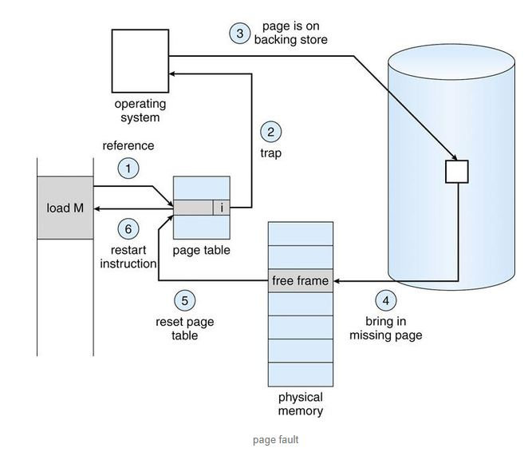
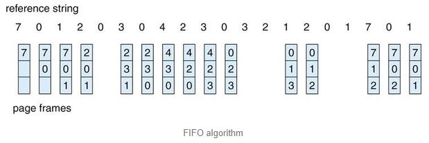
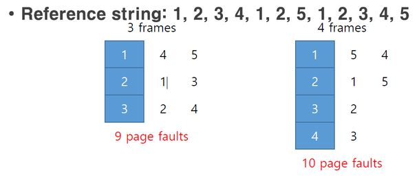
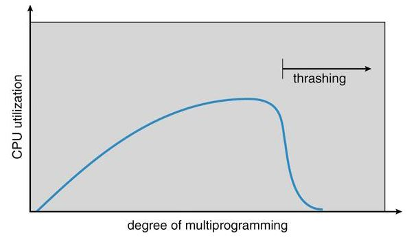

# 9주차 가상메모리와 프레임 할당

[TOC]

## 1. 가상메모리

프로그램이 CPU에서 실행되기 위해 실행에 당장 필요한 부분이 메모리에 올라와 있어야 한다.

바꾸어 말하면, 운영체제는 CPU에서 당장 수행해야 할 부분만을 메모리에 올려놓고, 그렇지 않은 부분은 Backing store라는 디스크의 스왑 영역(swap area)에 보관하였다가 필요해졌을 때 메모리에 올라가 있는 부분과 교체하는 방식을 사용할 수 있다는 말이다.

- EX) 배열이나 리스트를 크게 잡아놓고 사용하지 않는 부분이 크다면 사용하는 크기만큼만 실제 메모리에 올라가는 방식.

이와 같이 메모리의 연장 공간으로 디스크 스왑 영역이 사용될 수 있기 때문에 프로그램 입장에서는 물리적 메모리크기에 대한 제약을 고려할 필요가 없어진다. 나아가 운영체제는 프로그램이 물리적 메모리를 고려할 필요 없이 자기 자신만이 메모리를 사용하는 것처럼 가정해 프로그램하는 것을 지원한다. 이렇게 되면 프로그램은 **자기 자신만의 메모리 주소 공간을 가정할 수 있는데, 이러한 메모리 공간을 가상메모리(virtual memory)라고 부른다.** 즉, 가상메모리는 프로세스마다 각각 0번지부터의 주소 공간을 가지게 되며, 이들 공간 중 일부는 물리적 메모리에 적재되고 일부는 디스크의 스왑 영역에 존재하게 된다.

- 가상 메모리 기법을 사용하는 장점
  - 프로그램은 더 이상 물리적 메모리의 여유 공간이 얼마나 되는지 시작도 하기 전에 고민할 필요가 없어짐
  - 프로그램이 전체 다 올라가지 않기 때문에 더 많은 프로그램들을 동시에 메모리에 올려 실행할 수 있음
  - 한 번에 올리는 소스의 양이 적기 때문에 Disk와 Memory 간 I/O 작업속도가 빨라짐

프로세스의 주소 공간을 메모리로 적재하는 단위에 따라 가상메모리 기법은 **요구 페이징(Demand Paging)**과 요구 세그먼테이션(Demand Segmentation) 방식이 있는데, 대부분의 경우에서 요구 페이징 기법만이 사용된다.

---

## 2. 요구 페이징(Demand Paging)

프로그램 실행 시 프로세스를 구성하는 모든 페이지를 한꺼번에 메모리에 올리는 것이 아니라 **당장 사용될 페이지만을 메모리에 올리는 방식**이다.

따라서, 요구 페이징 기법에서는 특정 페이지에 대해 CPU의 요청이 들어온 후에야 해당 페이지를 메모리에 적재한다. 이를 통해 **메모리 감소, 프로세스 전체를 메모리에 올리는 데 소요되는 입출력 오버헤드 감소, 시스템의 더 많은 프로세스 수용 등 이점**을 갖을 수 있다. 

가상메모리 기법에서는 프로세스가 실행되는 동안 일부 페이지만 메모리에 올라와 있고 나머지 페이지는 디스크의 스왑 영역에 존재한다. 이러한 시스템에서는 특정 프로세스를 구성하는 페이지 중에서 **어떤 페이지가 메모리에 존재하는지 구별하기 위한 방안**이 필요하다.

이 때 사용하는 것이 **유효-무효 비트(valid-invalid bit)**이다.

---

### 2.1 유효-무효 비트(Valid-Invalid Bit)

case 1) Bit = Valid

  Bit가 Valid라는 뜻은 두 가지 의미를 내포한다. 해당 Page Table의 인덱스는 접근이 가능하며,  해당 부분은 실제 메모리에 올라와 있다는 뜻.

case 2) Bit = Invalid

  Bit가 Invalid라는 뜻 역시 두 가지 의미를 내포한다. 해당 Page Table의 인덱스는 접근 불가능하거나 혹은 해당 부분은 현재 Disk에 존재한다는 뜻.

---

### 2.2 페이지 부재(Page Fault) 처리

페이지 부재란 **CPU가 참조하려는 페이지가 현재 메모리에 올라와 있지 않아** 유효-무효 비트가 무효로 세팅되어 있는 경우를 말한다.

이렇게 CPU가 무효 페이지에 접근하면 주소 변환을 담당하는 하드웨어인 MMU가 페이지 부재 트랩을 발생시키게 된다. 그러면 다음과 같은 순서로 페이지 부재를 처리한다.

**1) 주소 변환을 위해 페이지 테이블에 접근**

**2) 유효-무효 비트가 invalid일 경우 trap 발생**

**3) OS가 해당 페이지에 대한 접근이 적법한지 여부 체크. 사용되지 않는 주소 영역에 속한 페이지에 접근하려 했거나 해당 페이지에 대한 접근 권한 위반을 했을 경우 프로세스를 종료**

**4) 적법할 경우 물리적 메모리에서 비어 있는 프레임을 할당 받아 그 공간에 해당 페이지를 읽어온다. 만약 비어 있는 프레임이 없다면 기존에 메모리에 올라와 있는 페이지 중 하나를 디스크로 스왑 아웃(swap out)한다.** 

**5) 페이지 테이블과 TLB(translation look a side buffer : 변환 색인 버퍼)의 각 항목(entry)를 swap-in / swap-out된 정보를 토대로 재설정(reset)한다.**

**6) page fault를 야기했던 프로세스의 명령부터 다시 재개한다.**

다음 그림은 Page Fault의 전체적인 흐름을 보여준다.

여기서 이런 의문이 생길수가 있다.

**실제 메모리에 비어있는 Frame이 존재하지 않으면 ???? **

이런 경우 사용하는 것이 Page Replacement 알고리즘이다.

---

## 3. 페이지 교체(Page Replacement)

페이지 부재가 발생하면 요청된 페이지를 디스크에서 메모리로 읽어와야 한다. 이때 물리적 메모리에 빈 프레임이 존재하지 않을 수 있다. 이 경우에는 메모리에 올라와 있는 페이지 중 하나를 디스크로 보내 메모리에 빈 공간을 확보하는 작업이 필요하고, 이것을 **페이지 교체**라고 한다.

### 3.1 페이지 교체 알고리즘

페이지 교체를 할 때에 어떠한 프레임에 있는 페이지를 쫓아낼 것인지 결정하는 알고리즘을 교체 알고리즘이라고 한다.

이 알고리즘의 목표는 **페이지 부재율을 최소화하는 것**이다. 그러므로 **가까운 미래에 참조될 가능성이 가장 적은 페이지(Victim Frame)**를 선택해서 내보내는 것이 성능을 향상시킬 수 있는 방안이고, 알고리즘의 성능은 주어진 페이지 참조열(Page Reference String)에 대해 부재율을 계산함으로써 평가할 수 있다.

아래에서 다시 한 번 설명하겠지만, 참조되는 해당 번호의 페이지가 메모리에 이미 올라와 있으면 메모리에서 적중되었다고 하고, 메모리에 없는 경우에는 페이지 부재가 발생했다고 말한다.

페이지 교체와 관련된 알고리즘은 다음과 같다.

- **최적 페이지 교체(Belady's optimal algorithm)**
- **선입선출 알고리즘(FIFO)**
- **LRU 알고리즘(Least Recently Used)**
- **Counting-Based 알고리즘 : LFU 알고리즘(Least Frequently Used), MFU(Most Frequently Used) 알고리즘**
- **클럭 알고리즘(clock)**

#### 3.1.1 최적 페이지 교체(Optimal algorithm)

가장 오랫동안 사용되지 않을 Frame을 Victim Frame으로 선택하는 알고리즘

> 말 그대로 사용되지 않을, 예측이 필요한 알고리즘이기 때문에 **이론상으로만 존재**하며 다른 알고리즘들의 성능 비교를 위해 사용된다.

네 번째 순서에서 2번 Page가 실행되어야 하는데, 메모리에 존재하지 않아 Page Fault가 일어나고, 비어있는 Frame을 만들기 위해 가장 오랫동안 사용되지 않을 Page의 Frame을 선택하게 되고, 위 그림에서 그 Victim Frame의 Page는 7번으로 선택되게 된다.

#### 3.1.2 선입선출 알고리즘(FIFO algorithm)

실제 메모리에 올라온지(Frame을 차지한지) 가장 오래된 Frame을 선택하는 알고리즘

하지만 FIFO 알고리즘은 Frame 수가 많은데 오히려 Page Fault가 많이 발생하는 모순을 일으키기도 한다.

(Frame이 많다면 당연히 Page Fault가 적어야한다.)

#### 3.1.3 LRU(Least Recently Used) algorithm

가장 오랫동안 사용되지 않은 Page의 Frame을 선택하는 알고리즘 (FIFO와 다름)

FIFO에서는 6 번째 실행 순서인 3번 Page가 Victim Frame으로 메모리에 올라온지 가장 오래된 0번 Page의 Frame을 선택한 반면, LRU에서는 0 번째 Page는 바로 직전에 실행되었기 때문에 실행된지 가장 오래된 1번 Page의 Frame을 선택함.

LRU 알고리즘은 최근에 실행되었으면 금방 다시 한 번 사용될 것이라고 가정하기 때문 !

이와 같은 LRU 알고리즘을 구현하기 위해서는 두 가지 방법이 있다.

- 첫 번째 : 해당 Page가 실행될 때 실행된 시간을 Page Table의 해당 부분에 저장하는 방법.

- 두 번째 : 실행되는 순서를 Stack 으로 쌓아서 관리하는 것. 그러면 Stack의 순서는 위에서 아래로 최근에서 과거 순이 됨.

  

#### 3.1.4 Counting-Based 알고리즘

- 1. LFU (Least Frequently Used) 알고리즘

  LFU 알고리즘은 물리적 메모리 내에 존재하는 페이지 중 과거에 참조 횟수가 가장 적었던 페이지를 쫓아내고 그 자리에 새로 참조될 페이지를 적재한다. **최저 참조 횟수를 가진 페이지가 여러개라면 임의로 하나를 선정한다.**

  이 때 페이지 참조 횟수를 계산하는 방식도 두 가지가 있다.

  - Incache-LFU : 페이지가 물리적 메모리에 올라온 후부터의 참조 횟수를 카운트하는 방식. 즉, 페이지가 나갔다가 다시 들어온 경우 참조 횟수는 다시 1부터 카운트
  - Perfect-LFU : 페이지 부재 여부와 상관없이 과거의 총 참조 횟수를 카운트. 참조 횟수를 정확히 반영할 수 있는 장점이 있지만 스왑 영역에 있는 페이지의 참조 기록까지 모두 보관해야 하므로 오버헤드가 크다.

- 2. MFU (Most Frequently Used) 알고리즘

  MFU 알고리즘은 참조 횟수가 가장 많은 페이지를 Victim 페이지로 선택하는 알고리즘.

  (지금까지 많이 참조했으니 앞으로는 참조되지 않을 것이다라는 논리)

#### 3.1.5 클락 알고리즘(Clock Algorithm)

요구 페이징 기법에서 LRU, LFU 알고리즘의 구현은 실제로는 불가능하다. 각각 가장 오래된 페이지, 각 페이지의 참조횟수에 대한 정보를 저장해야하는데 **이미 메모리에 있는 페이지 접근의 경우, 운영체제의 관여없이 하드웨어에서 일어나기 때문에 해당 정보를 저장할 수 없기 때문이다.**

그래서 실제 Paging System에서 사용할 수 있는 알고리즘으로 Clock Algorithm이 있다.

클락 알고리즘은 하드웨어적인 지원을 통해 LRU, LFU 알고리즘에서의 운영 오버헤드를 줄일 수 있다. 이는 LRU를 근사시킨 알고리즘으로, LRU 알고리즘이 가장 오래전에 참조된 페이지를 교체하는 것에 반해 클락 알고리즘은 오랫동안 참조되지 않은 페이지 중 하나를 교체한다. 즉, 최근에 참조되지 않은 페이지를 교체 대상으로 선정하는 것은 유사하지만, 교체되는 페이지의 참조 시점이 가장 오래되었다는 것을 보장할 수는 없다. But 하드웨어적인 지원으로 동작하기 때문에 LRU에 비해 페이지의 관리가 훨씬 빠르고 효율적으로 이루어진다. 따라서 대부분의 시스템에서 페이지 교체 알고리즘으로 클락 알고리즘을 채택한다.

이 알고리즘은 교체할 페이지를 선정하기 위해 페이지 **프레임들의 참조비트(Referenve Bit)를 순차적으로 조사**한다. 참조비트는 각 프레임마다 하나씩 존재하며 그 프레임 내의 페이지가 참조될 때 하드웨어에 의해 1로 세팅된다. 여기서 클락 알고리즘은 참조비트가 1인 프레임은 0으로 바꾼 뒤 그냥 지나가고, 참조비트가 0인 페이지를 교체한다. 모든 페이지 프레임을 다 조사한 경우 첫 번째 페이지 프레임부터 조사 작업을 반복한다.

추가적으로 **변경 비트(Modified Bit)를 관리한다**. 변경 비트는 페이지가 메모리에 올라온 이후 수정이 발생할 경우 1로 설정되며, 0인 프레임은 메모리에 올라온 페이지와 디스크에 있는 프레임이 같은 내용임을 의미한다. 변경 비트가 1인 페이지는 스왑 아웃 시 Backing Store에 해당 내용 반영을 위한 작업이 추가적으로 발생함을 고려해 변경 비트가 0인 페이지를 우선적으로 스왑하도록 한다.

---

## 4. 프레임 할당

프로세스 여러개가 동시에 수행되는 상황에서, **각 프로세스에게 얼마 만큼의 메모리 공간을 할당할 것인지를 결정**해야 한다.

프레임 할당 방법은 몇 가지가 존재하는데, 기본적인 방법은 다음과 같다.

1. **균등 할당(Equal allocation) : 프로세스의 목적과 성격에 상관없이 모든 프로세스에게 고정된 양의 프레임을 할당해준다.**

2. **비례 할당(Propotional allocation) : 프로세스의 크기에 비례하여 페이지 프레임을 할당해준다.**

3. **우선순위 할당(Priority allocation) : 우선순위가 높은 프로세스에게 더 많은 양의 Frame을 할당해준다.**

   (보다 많은 Frame을 할당받으면 Page Fault 횟수가 감소하게 되고, 프로세스는 작업을 보다 빨리 마치게 된다. 즉, 우선순위가 높은 프로세스의 작업을 빨리 마치게끔 하여 Frame의 순환율을 높이기 위한 방법이다.)

위에서 언급된 3가지 페이지 프레임 할당 알고리즘만으로는 **프로세스의 페이지 참조 특성을 제대로 반영하지 못할 우려가 있다.**

예를 들어, 현재 수행하는 프로세스의 수가 지나치게 많은 경우 프로세스당 할당되는 메모리양이 너무 적어질 수 있고, 프로세스를 정상적으로 수행하기 위해서는 최소한의 수준 이상의 프레임을 각 프로세스에 할당해야 한다.

반복문을 실행하는 프로세스의 경우, 반복문을 구성하는 페이지들을 한꺼번에 메모리에 올려놓는 것이 유리하다. 만약, 반복문을 구성하는 페이지의 수보다 적은 양의 프레임을 할당하면, 매 반복마다 적어도 한 번 이상의 페이지 부재가 발생하여 성능이 현저히 떨어질 것이기 때문이다.

또한 프로세스에게 최소한으로 필요한 메모리의 양은 시간에 따라 달라질 수 있다. 그러므로 상황을 고려해 각 프로세스에게 할당되는 페이지 프레임의 수를 결정해야하고, 경우에 따라 일부 프로세스에게 메모리를 아예 할당하지 않는 방식을 채택하여 나머지 프로세스에 최소한의 메모리 요구량을 충족할 수 있어야 한다.

### 4.1 전역교체와 지역교체

교체할 페이지를 선정할 때, 교체 대상이 도리 프레임의 범위를 어떻게 정하느냐에 따라 교체 방법을 **전역교체(Global Replacement)와 지역교체(Local Replacement)**로 구분할 수도 있다.

- 전역교체
  - **모든 페이지 프레임이 교체 대상이 될 수 있다.**
  - 교체 알고리즘에 근거해 할당되는 메모리량이 가변적으로 변하는 방법이다.
  - 일반적으로 많이 사용하며, 좋은 성능을 나타낸다.
- 지역교체
  - **현재 수행중인 프로세스에게 할당된 프레임 내에서만 교체 대상을 선정할 수 있다.**
  - 프로세스마다 페이지 프레임을 미리 할당하는 것은 전제로 한다.
  - 외부적 환경의 영향을 받지 않지만, 잘 사용하지 않는 페이지 프레임이 있어도 그대로 낭비할 수 있다.

---

## 5. 스레싱(Thrashing)

프로세스의 원활한 수행에 필요한 최소한의 Page Frame수를 할당받지 못한 경우에 발생하는 현상

충분한 Page Frame 수를 할당받지 못하면 Page Fault가 발생하는 횟수(페이지 부재율 : Page Fault Rate)가 늘어나게 되고, 이는 CPU 자원 이용률(CPU Utilization)을 떨어뜨린다. 왜냐하면 자원을 할당받은 시간 내에 CPU 자원을 사용하기보다 **I/O 작업에 시간을 더욱 소비하기 때문.**

이는 Multi-Programming과 큰 관련이 있다.

운영체제는 CPU의 이용률이 낮을 경우, 메모리에 올라와있는 프로세스가 적기 때문이라고 판단한다.

준비큐에 프로세스가 존재하면, CPU는 그 프로세스를 실행하므로 쉬지않고 일하게 된다. 즉, CPU 이용률이 낮다는 의미는 준비큐가 비는 경우가 발생한다는 뜻이다. 그러므로 운영체제는 메모리에 올라와 있는 프로세스의 수를 늘리게 된다.

이때, 메모리에 동시에 올라와 있는 프로세스의 수를 다중 프로그래밍 정도(MPD : Multi-Programming Degree)라고 한다. MPD가 너무 커지면, 각 프로세스에게 할당되는 메모리 양이 지나치게 감소하게 된다. 그렇게 되면 필요한 최소한의 페이지 프레임을 할당받지 못해 페이지 부재가 빈번히 발생하게 된다.

이 과정이 반복되면 시스템은 페이지 부재를 처리하느라 매우 분주해지고, CPU 이용률이 급격히 감소한다. 그리고 **MPD를 높이기 위해 다른 프로세스를 메모리에 추가하게 되는 악순환이 반복된다**. 이러한 현상을 스레싱이라고 한다.

- 이러한 스레싱을 방지하는 방법으로 **워킹셋 알고리즘과 페이지빈도 알고리즘**이 존재한다.

### 5.1 워킹셋(working-set) 알고리즘

**Working-Set Model은 각 프로세스가 필요로 하는 최소한의 프레임 수를 보장해준다.**

프로세스는 일정 시간동안 특정 주소 영역을 집중적으로 참조하는 경향이 있다. 이 집중적으로 참조되는 페이지들의 집합을 지역성 집합(Locality Set)이라고 한다.

프로세스가 일정 시간동안 원활히 수행되기 위해 메모리에 한꺼번에 올라가 있어야하는 페이지들의 집합을 **워킹셋(Working Set)**이라고 정의하고, 이 워킹셋을 구성하는 페이지들이 한꺼번에 메모리에 올라갈 수 있는 경우에만 그 프로세스에게 메모리를 할당한다. 그럴 수 없는 경우에는 프로세스에게 할당된 페이지 프레임들을 모두 반납시킨 후 그 프로세스의 주소 공간 전체를 디스크로 스왑아웃 시킨다.

즉, 이미 메모리에 올라가있는 다른 프로세스에게 Page Frame을 양보함으로써 스레싱을 방지하는 것이다.

### 5.2 페이지 부재 빈도 (PFF : Page Fault Frequency) 알고리즘

페이지 부재 빈도 알고리즘에서는 페이지 부재율을 주기적으로 조사하고, 이 값에 근거하여 각 프로세스에 할당할 메모리 양을 조절한다.

어떤 프로세스의 페이지 부재율이 시스템에 미리 정해놓은 상한값을 넘게 되면, 이 프로세스에 할당된 프레임의 수가 부족하다는 의미이므로, 프레임을 추가로 더 할당한다.

이때, 추가로 할당할 빈 프레임이 없다면 일부 프로세스를 스왑아웃시켜 메모리에 올라가 있는 프로세스의 수를 조절한다.

반면에 프로세스의 부재율이 하한값 이하로 떨어지면, 이 프로세스에게 필요 이상의 프레임이 할당된 것으로 간주하여 프레임 수를 줄인다.

이러한 방식으로 메모리 내에 존재하는 모든 프로세스에게 필요한 프레임을 다 할당한 후에도 프레임이 남은 경우, 스왑아웃 되었던 프로세스에게 프레임을 할당함으로써 MPD를 높일 수 있다.

---

##### Reference

**참고**

· [https://ko.wikipedia.org/wiki/%EA%B0%80%EC%83%81_%EB%A9%94%EB%AA%A8%EB%A6%AC](https://ko.wikipedia.org/wiki/가상_메모리)

· https://vmilsh.tistory.com/384

· https://jupiny.com/2017/03/28/paging-segmentation/

· http://egloos.zum.com/sweeper/v/2988689

· https://bywords.tistory.com/117

· https://dakuo.tistory.com/104