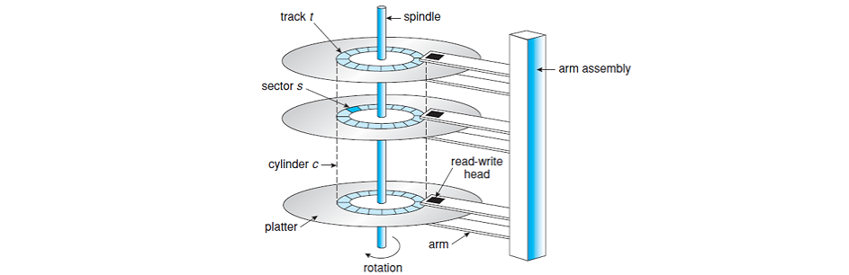
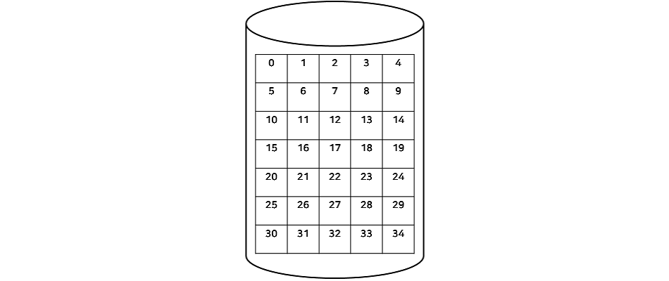
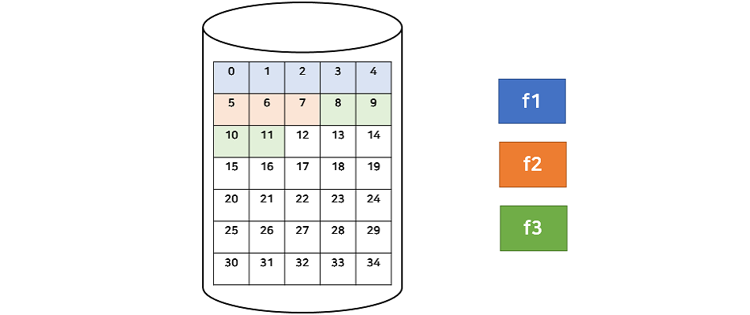
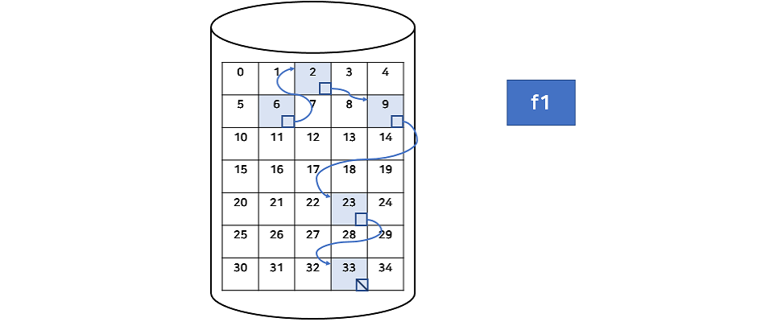
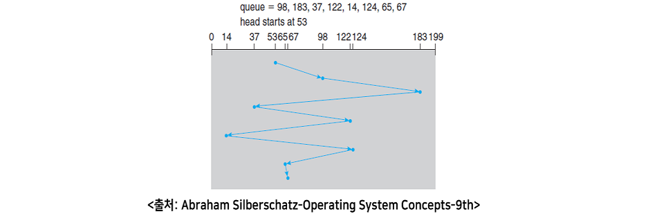
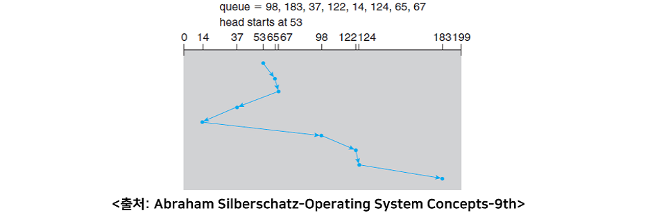
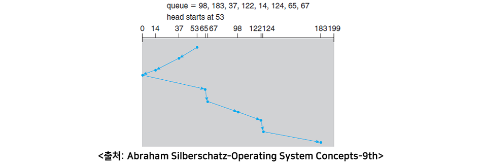

[toc]

## 1. 파일 할당

> 하드디스크에서의 파일 할당



- **platter**: 실제 데이터를 기록하는 자성을 가진 원판이다. platter는 그림과 같이 여러 개가 존재하고 앞뒤로 사용할 수 있다. 한 platter는 여러 개의 track으로 이루어져 있다.
- **track**: platter의 동심원을 이루는 하나의 영역이다.
- **sector**: 하나의 track을 여러 개로 나눈 영역을 sector라 한다. sector size는 일반적으로 512 bytes이며 주로 여러 개를 묶어서 사용한다.
- **cylinder**: 한 cylinder는 모든 platter에서 같은 track 위치의 집합을 말한다.
- **block**: sector를 여러 개로 묶은 것을 말한다.
- **pool of free blocks**: 디스크는 비어있는 블록들의 집합




### 1 연속 할당(Contiguous Allocation)



- 연속된 블록에 파일을 할당하는 방법
- 디스크 헤더의 이동을 최소화할 수 있는 장점을 가짐.
  - I/O 성능을 높일 수 있다.
  - 동영상, 음악, VOD 등에 적합
- 순차 접근(Sequential Access)이 가능
- 직접 접근(Direct Access)이 가능
  - 운영체제는 파일의 정보를 디렉토리(Directory)라는 테이블에 저장한다. 
  
  - 디렉토리에서 사용자가 접근 가능한 정보는 파일의 이름, 크기, 날짜 등이 있고, 운영체제 내부에서 접근하는 정보는 해당 파일의 시작 블록 번호와 같은 것이 있다.  
  
  - f1 파일의 디렉토리 정보는 아래와 같다.
  
    ```
    file name: f1
    file size: 5 bytes
    ...
    -----------------
    block number: 0
    ```
  
    
  
  - 연속 할당은 순차적으로 저장되어 있으므로 운영체제는 디렉토리에서 얻은 시작 블록 번호로 원하는 블록에 바로 접근할 수 있다. 
- 외부 단편화 문제가 발생한다는 단점
  
  - 파일을 할당하고 지우고를 반복하다보면 중간 중간에 빈 공간(hole)이 생기는데 연속 할당은 연속된 공간을 찾아야 하기 때문.
  - 외부 단편화?
    - 중간중간에 사용하지 않는 메모리가 존재해서 총 메모리 공간은 충분하지만 실제로 할당할 수 없는 상황
- 파일을 저장할 때 실제 크기를 알 수 없다.
  
  - 지속적으로 사용하는 파일은 크기가 계속 증가하는데 이를 연속적으로 할당하기에 적절하지 않음.


### 2 연결 할당(Linked Allocation)



- 연결 할당은 연속 할당의 문제점을 해결하기 위해 나온 방법으로, 연속적으로 할당하는 것이 아니라 linked list 방식으로 파일을 할당한다.

- 위의 그림은 block 크기가 1 byte, 파일 f1의 크기가 5 bytes 일 때 연결 할당을 수행한 모습이다. 각 블록의 마지막에 주소를 저장하는 포인터 공간(4bytes)이 존재하며, 여기서 다음 블록을 가리키고 있다. 마지막 블록의 포인터 공간에는 끝임을 나타내는 값이 저장되어 있다.

- 이런 파일을 linked list of data blocks 라고 하며, f1의 파일 디렉토리 정보는 아래와 같다.

  ```
  file name: f1
  file size: 5 bytes
  ...
  -----------------
  block number: 6
  ```

- 연결 할당을 사용해서 새로운 파일을 할당할 때는 비어있는 임의의 블록을 첫 블록으로 선택하며, 만약 파일이 커지는 경우 다른 블록을 할당해서 기존의 블록과 연결만 해주면 된다. 

- 연결 할당은 위치와 상관없이 할당이 가능하므로 외부 단편화 문제가 없다. (= 디스크 낭비가 없다.)

- 단점

  - 순차 접근은 가능하지만 직접 접근은 불가능하다. 
    -  파일의 블록들은 모두 흩어져 있으므로 시작 블록 번호를 가지고는 원하는 위치의 블록에 바로 접근할 수는 없다.
  - 포인터를 저장하는 4 bytes 이상의 손해가 발생한다.
  - 낮은 신뢰성
    - 중간 블록의 포인터가 끊어지면 그 이후의 모든 블록에 접근하지 못한다.
  - 느린 속도
    - 블록이 모두 흩어져 있으므로 디스크 헤더의 움직임이 그 만큼 많이 발생한다.

- 이러한 단점을 개선하기 위해 FAT(File Allocation Table)를 사용


- 위 그림에서 0번 블록에 저장된 FAT를 보면 테이블의 인덱스는 전체 디스크의 블록 번호이며, 각 인덱스마다 다음 블록 번호를 저장하고 있다.
- FAT를 읽으면 직접 접근이 가능하고, 중간 블록에 문제가 생겨도 FAT를 통해 그 다음 블록을 읽을 수 있다. 
- FAT는 일반적으로 메모리 캐싱을 사용하여 블록 위치를 찾는데는 빠르지만 실제 디스크 헤더가 움직는 것은 블록이 흩어져 있으므로 여전히 느리다고 볼 수 있다. 
- FAT는 매우 중요한 정보이므로 손실 시 복구를 위해 이중 저장을 한다.


### 3 색인 할당(Indexed Allocation)


- 색인 할당 역시 연결 할당과 같이 데이터를 랜덤한 블록 번호에 할당하지만 할당된 블록 번호(포인터)를 하나의 블록에 따로 저장한다.

- 이러한 블록을 **인덱스 블록**이라고 부르며, 파일 당 하나의 인덱스 블록이 존재한다.

- 색인 할당은 시작 블록 번호를 저장하는 것이 아니라 **인덱스 블록 번호를 저장**한다.

- 위 그림은 block의 크기가 1 byte, f1과 f2의 크기가 각각 5 bytes, 2 bytes일 때 색인 할당을 수행한 모습이다. f1과 f2의 디렉토리 정보는 다음과 같다.

  ```
  file name: f1
  file size: 5 bytes
  ...
  -----------------
  index block number: 11
  ```

  ```
  file name: f2
  file size: 2 bytes
  ...
  -----------------
  index block number: 27
  ```

- 색인 할당은 인덱스 블록에 할당된 블록을 순서대로 저장하기 때문에 직접 접근이 가능하다. 그리고 연속적으로 할당할 필요가 없으므로 외부 단편화 문제 또한 발생하지 않는다. 색인 할당은 Unix/Linux에서 주로 사용한다.

- 단점

  - 작은 크기의 파일인 경우에도 하나의 블록을 인덱스 블록으로 사용하기 때문에 저장 공간이 손실된다.
  - 하나의 인덱스 블록을 가지고는 크기가 큰 파일을 저장할 수 없다.
    - 하나의 블록 크기가 512 bytes인 블록이 최대 저장할 수 있는 블록 인덱스 개수는 512 / 4 bytes(포인터 크기) = 128개이다.  
    - 파일의 최대 크기는 128 * 512 bytes = 64KB로 아주 작은 크기이다. 블록 크기가 1KB이라 하더라도 최대 인덱스 개수는 256개(1000/4)이고 최대 파일의 크기는 256KB이다.

- 단점을 해결하기 위한 방법

  1. Linked: 인덱스 블록을 여러 개 만들어 연결 할당을 하는 것과 같다. 각 인덱스 블록의 마지막은 다음 인덱스 블록을 가리키는 포인터가 저장되어 있다.

  

  2. Multilevel index: 하나의 인덱스 블록의 모든 포인터가 다른 인덱스 블록을 가리킨다. 만약 부족하면 계층을 더 만들어 간다.

  

  3. Combined: Linked와 Multilevel index를 합친 방법으로 한 인덱스 블록의 포인터들은 데이터 블록과 또 다른 인덱스 블록 둘 다 가리킬 수 있다.


## 2. 디스크 스케쥴링(Disk Scheduling)

- 디스크 접근 시간
  - Seek time + retotatinal delay(track이 도는시간) + transfer time
  - 탐색시간(seek time)이 가장 크다. = header를 움직이는 시간
- 다중 프로그래밍 환경
  - 디스크 큐(disk queue)에는 많은 요청(request)들이 쌓여있다.
  - 요청들을 어떻게 처리하면 탐색시간을 줄일 수 있을까? = **디스크 스케줄링 알고리즘**

### 1. FCFS(First Come First Served)

- 200 cylinder dist: 0, 1, 2, …, 199 Disk queue: 98, 183, 37, 122, 14, 124, 65, 67 현재 헤드가 가리키는 실린더(cylinder) 위치: 53



- 가로축은 0번부터 199번까지 실린더의 위치를 나타낸다.
- 파란색 선이 dist queue를 FCFS 방법으로 처리한 결과이다.
- **헤드가 움직인 총 거리** = (98 - 53) + (183 - 98) + (183 - 37) + (122 - 37) + (122 - 14) + (124 - 14) + (124 - 65) + (67 - 65) = **640 cylinders**
- 큐에 들어온 순서가 큰 값, 작은 값이 반복한다면 헤드가 움직이는 거리가 매우 커지는 단점이 생기게 된다.


### 2. (SSTF)Shortest-Seek-Time-First

- 가장 짧은 탐색 시간을 먼저 선택하는 것이다.
- 200 cylinder dist: 0, 1, 2, …, 199 Disk queue: 98, 183, 37, 122, 14, 124, 65, 67 현재 헤드가 가리키는 실린더(cylinder) 위치: 53



- 처음 헤드 위치 53을 시작으로 dist queue에 있는 실린더 번호 중 53과 가장 가까운 65번 실린더를 선택한다. 65번에서는 가장 가까운 67번을 선택하고 같은 과정을 반복한다.
- **헤드가 움직인 총 거리** = (65 - 53) + (67 - 65) + (67 - 37) + (37 - 14) + (98 - 14) + (122 - 98) + (124 - 122) + (183 - 124) = **236 cylinders**
- FCFS 스케줄링보다 훨씬 적은 수의 실린더를 움직인다.
- 하지만 starvation이 발생할 수 있다.
  - dist queue에는 지속적으로 새로운 프로세스의 요청이 들어오기 때문에 헤드와 멀리 떨어져 있는 실린더는 끝내 수행하지 못하는 현상이 발생하는데, 이를 starvation이라고 한다.
- SSTF 스케줄링이 현재와 가장 가까운 실린더를 선택한다고 해서 최적의 알고리즘은 아니다.
  -  처음 위치인 53번 실린더에서 65번이 아닌 37번으로 이동한 후에 SSTF 알고리즘을 수행하면 208 cylinders가 나온다.


### 3. Scan Scheduling

- 헤드가 지속적으로 디스크를 앞뒤로 검사하는 것이다.
- 헤드가 앞으로 스캔할 때(번호가 작은 실린더 방향)와 뒤로 스캔할 때(번호가 큰 실린더 방향) 선택하는 실린더가 서로 다르다.
- 200 cylinder dist: 0, 1, 2, …, 199 Disk queue: 98, 183, 37, 122, 14, 124, 65, 67 현재 헤드가 가리키는 실린더(cylinder) 위치: 53 스캔 방향: 0번 방향으로 움직임(번호가 작은 실린더 방향)



- **헤드가 움직인 총 거리** = (53 - 37) + (37 - 14) + (14 - 0) + (65 - 0) + (67 - 65) + (98 - 67) + (122 - 98) + (124 - 122) + (183 - 124) = **236 cylinders**
- 일반적으로 프로세스들이 디스크에 요청할 때 그 위치를 종합해보면 실린더에 골고루 퍼져있기 때문에한 방향으로 끝까지 움직이고 다시 처음으로 되돌아가서 같은 방향으로 끝까지 움직이는 것이 더욱 효과적이다.


### 4. Scan Variants

####  1. C-Scan(Circular Scan)

- 한 방향으로 계속 움직여 마치 원형으로 움직인 것과 같은 모습의 알고리즘이다. 움직이는 거리는 더 길어질 수 있지만 다시 처음 위치로 되돌아갈 때는 데이터를 읽지 않으므로 더 빠른 속도로 움직일 수 있다.

#### 2. Look

- Scan 스케줄링에서 0번 실린더가 존재하지 않지만 0번까지 가는 비효율적인 움직임을 없애기 위해 존재하는 실린더의 최소와 최대 범위만 움직이는 알고리즘이다. 하지만 범위를 알기 위해서 미리 큐를 검사해야한다.

#### 3. C-Look(Circular Look)

- C-Look은 Look의 범위에서 C-Scan과 같이 한 방향으로만 움직이는 것을 말한다. 최대 실린더에서 최소 실린더 방향으로 움직인다고 할 때 최소 범위에 도달하면 다시 최대 범위로 되돌아가서 같은 방향으로 움직인다.


### 5. Elevator Algorithm

- Elevator Algorithm은 Scan과 파생되어 나온 알고리즘(C-scan, Look, C-Look)을 부르는 다른 용어이다. Scan 스케줄링 알고리즘 예제 그림을 90도로 회전하면 엘리베이터의 모습과 유사하여 붙여진 이름이다.